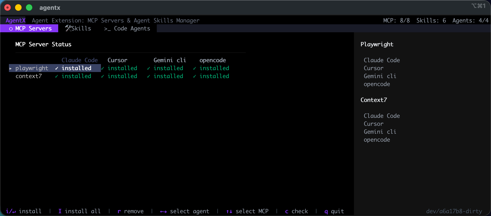
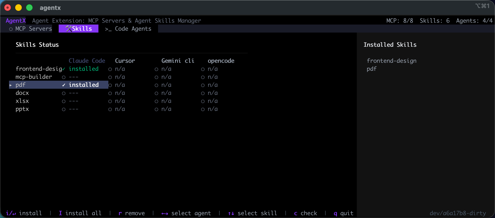

# AgentX

中文 | [English](README.md)

AgentX 即 Agent eXtension：一个统一的 CLI 工具，用于在多个 AI 编程代理之间管理 **MCP（Model Context Protocol）服务器** 与 **Skills**。

## 概览

AgentX 简化了在主流 AI 编程工具中安装、管理与监控 MCP 服务器与 Skills 的流程：

- **Claude Code**
- **Codex**
- **Cursor**
- **Gemini CLI**
- **OpenCode**

它同时提供命令行接口与交互式终端 UI（TUI），便于统一配置管理。

## 特性

### MCP 服务器管理
- 在多个代理之间安装/移除 MCP 服务器
- 检查安装状态
- 一键安装到所有支持的代理
- 支持的 MCP 服务器：
  - **Playwright** - 浏览器自动化能力
  - **Context7** - 库文档访问

### Claude Code 与 Codex Skills 管理
- 从本地路径或 Git 仓库安装 Skills
- 支持 Skills 目录（包含 `SKILL.md`）；Claude Code 还支持命令文件（`.md`）
- 支持带 tree 路径的 GitHub URL
- 支持个人与项目级作用域
- Skills 健康检查与验证

### 交互式 TUI
- 三个主标签：MCP Servers、Skills、Code Agents
- 可视化矩阵展示各代理的 MCP 安装状态
- 键盘快捷键快速操作
- 实时状态刷新

## 安装

### 1. Homebrew（macOS/Linux）

```bash
# 添加 tap（指向本仓库）
brew tap agentsdance/agentx https://github.com/agentsdance/agentx.git

# 安装 agentx
brew install agentx

# 升级到最新版本
brew upgrade agentx
```

### 2. 下载二进制

从 [GitHub Releases](https://github.com/agentsdance/agentx/releases) 下载最新版本。

### 3. Go Install

```bash
go install github.com/agentsdance/agentx@latest
```

### 4. 从源码构建

```bash
# 克隆仓库
git clone https://github.com/agentsdance/agentx.git
cd agentx

# 构建
make build

# 安装到 /usr/local/bin（可通过 PREFIX 环境变量自定义）
make install
```

### 前置条件

- **Go 1.25+**（构建所需）
- **Node.js with npm**（MCP 服务器通过 npx 运行）
- **Git**（克隆 Skills 仓库）

## 使用

### 交互模式

启动交互式 TUI：

```bash
agentx
```

键盘快捷键：
- `Tab` / `Shift+Tab` - 切换标签
- `↑` / `↓` - 导航条目
- `Enter` - 选择/切换
- `q` / `Ctrl+C` - 退出

### CLI 命令





### 命令别名

工具响应以下命令：`agentx`、`agents` 或 `ax`

## 配置

### 代理配置路径

| Agent | 配置路径 |
|-------|----------|
| Claude Code | `~/.claude.json` |
| Codex | `~/.codex/config.toml` |
| Cursor | `~/.cursor/mcp.json` |
| Gemini CLI | `~/.gemini/settings.json` |
| OpenCode | `~/.opencode/config.json` |

### Skills 存储

Claude Code：

| Scope | Skills Directory | Commands Directory |
|-------|------------------|-------------------|
| Personal | `~/.claude/skills/` | `~/.claude/commands/` |
| Project | `.claude/skills/` | `.claude/commands/` |

Codex：

| Scope | Skills Directory |
|-------|------------------|
| Personal | `$CODEX_HOME/skills/`（默认 `~/.codex/skills/`） |
| Project | `.codex/skills/` |

## 项目结构

```
agentx/
├── cmd/                    # CLI 命令
├── internal/
│   ├── agent/             # 代理实现（Claude, Codex, Cursor, Gemini, OpenCode）
│   ├── config/            # 配置管理
│   ├── skills/            # Skills 管理
│   ├── mcp/               # MCP 相关逻辑
│   └── version/           # 版本信息
├── ui/
│   ├── components/        # 可复用 UI 组件
│   ├── views/             # 视图（MCP、Skills、Agents）
│   └── theme/             # 主题样式
├── main.go                # 入口
├── Makefile               # 构建目标
└── go.mod                 # Go 模块定义
```

## 可用 Skills

AgentX 内置了以下预配置 Skills：

| Skill | Description |
|-------|-------------|
| `frontend-design` | 生产级 UI 设计 |
| `mcp-builder` | 构建 MCP 服务器 |
| `pdf` | PDF 文档处理 |
| `docx` | Word 文档处理 |
| `xlsx` | Excel 文档处理 |
| `pptx` | PowerPoint 文档处理 |

## 许可证

Apache 2.0 - 详见 [LICENSE](LICENSE)。
